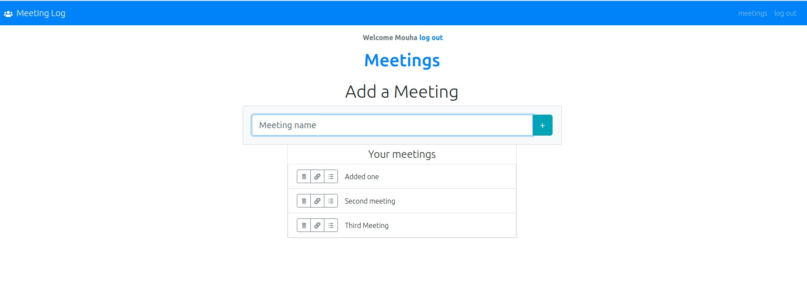

# Building a Recipe app with React & Redux.

## Technologies

- React
- Firebase
- npm
- CSS
- ES6

## Live Version 
<a href="https://meetingsmo.netlify.app/login" target="_blank" > Live version </a>

## About the Project

The project is a meeting app built with React and firebase as the backend.

## Developed by

Mouhamadou Diouf ( <a href="https://github.com/MouhaDiouf"> @mouhad </a>)

## Contributing

1. Fork it (https://github.com/MouhaDiouf/react-meeting-spa)
2. Create your feature branch (git checkout -b feature/[choose-a-name])
3. Commit your changes (git commit -am 'What this commit will fix/add')
4. Push to the branch (git push origin feature/[chosen name])
5. Create a new Pull Request